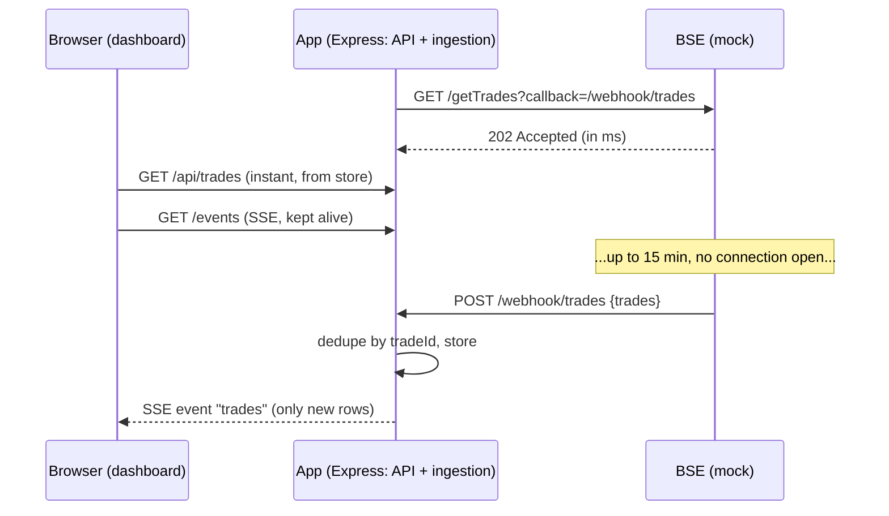

# Architecture note

## Problem
A BSE pull takes up to 15 min, but our network kills any HTTP connection open longer than 30 s. The dashboard must open instantly, show what is already pulled, and update itself when a pull finishes, with no refresh, no polling and no scheduler.

## Design

## Why this design
- **Async request/callback (202 + webhook)**: no HTTP connection is ever held for 15 minutes. Every call is short-lived, so the 30 s limit never applies. The alternative (long-held request) is what the mock does if you omit `callback`, and it is what would be killed.
- **No polling anywhere**: the app does not poll BSE (BSE calls back) and the browser does not poll the app (server pushes).
- **Server-Sent Events for the dashboard**: one-way server→browser push over plain HTTP, auto-reconnect built in, simpler than WebSockets. A 15 s comment heartbeat keeps the stream alive through the 30 s idle cut.
- **Instant open**: `/api/trades` only reads the store, never waits on BSE, so it is fast even mid-pull. State (pulling, ETA) rides along.
- **Idempotent ingestion**: trades are deduped by `tradeId`, so webhook retries (the mock retries up to 5 times) are safe.
- **What triggers a pull without a scheduler**: app boot for the first pull, then each pull's completion (the webhook) starts the next one. Nothing is timer-driven, so there is no cron or scheduler.

## Production notes (out of scope here)
Persist trades in a DB (Mongo/Postgres) and the job state in it too so a restart doesn't lose a pending job; sign/authenticate the webhook; if the app runs on several instances, fan SSE out via Redis pub/sub; if BSE can't call back, use a small queue worker that polls BSE outside the request path.
