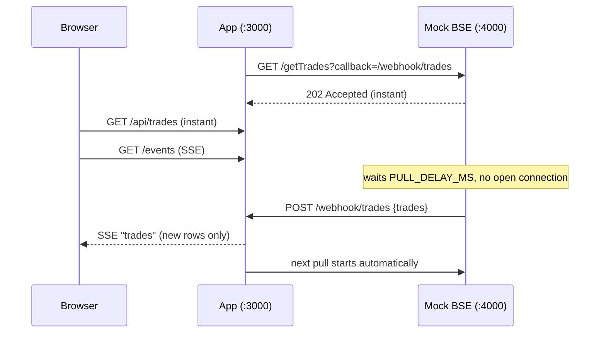

# BSE Trades: async pull + live dashboard

A mock BSE Exchange API whose full pull takes 15 minutes, plus a dashboard that opens instantly, shows trades already pulled, and updates itself when a pull completes. It works within a network that kills any HTTP connection held open longer than 30 seconds.

- Design and reasoning: [ARCHITECTURE.md](ARCHITECTURE.md)
- Stack: Node.js 18+, Express, vanilla JS. The only dependency is `express`.

## Quick start

```bash
npm install
npm run demo      # 20 s pull delay, for demos and the video
npm start         # real 15 min pull delay
```

Open **http://localhost:3000**. The mock BSE runs on port 4000.

Custom delay (works on Windows, macOS and Linux):

```bash
node start.js --delay=45000
```

## What you will see

1. The dashboard opens immediately with 3,000 trades and the banner "Pull in progress, about Xm Ys left. Showing trades already pulled."
2. When the pull completes, the new trades appear on their own, highlighted, with a "N new trades added" message and an updated count. No refresh.
3. The next pull starts automatically, so the cycle repeats.

The table shows the 500 most recent trades by timestamp and has a filter box (client, symbol or trade ID). The counter shows the total loaded.

## How it works



- **No long connection:** BSE replies `202` in milliseconds and calls the app's webhook when the data is ready, so the 30 s limit never applies.
- **No polling, no cron:** BSE calls back, the server pushes to the browser with Server-Sent Events, and each pull's completion starts the next one.
- **Instant open:** on boot the app loads an instant snapshot (`/getTrades?delay=0`), so the dashboard has data while the first real pull runs.
- **Safe retries:** trades are deduplicated by `tradeId`, and the mock retries webhook delivery up to 5 times.

## Configuration (environment variables)

| Variable | Default | Meaning |
|---|---|---|
| `PULL_DELAY_MS` | `900000` (15 min) | Mock BSE pull time |
| `TRADE_COUNT` | `3000` | Trades generated per pull |
| `AUTO_PULL` | `true` | Start the next pull when one completes (`false` = stop after the first) |
| `PORT` | `3000` | App and dashboard port |
| `BSE_PORT` | `4000` | Mock BSE port |
| `BSE_URL` | `http://localhost:4000` | Where the app finds BSE |
| `SELF_URL` | `http://localhost:$PORT` | Webhook base URL that BSE calls back |

PowerShell example: `$env:TRADE_COUNT=5000; npm run demo`

## API

**Mock BSE (:4000)**

| Request | Behaviour |
|---|---|
| `GET /getTrades?callback=<url>` | `202` at once; POSTs `{jobId, trades}` to `<url>` after the delay |
| `GET /getTrades?delay=<ms>` | Overrides the delay. `delay=0` returns trades immediately |
| `GET /getTrades` | Holds the connection for the full delay, then returns the trades (the naive pattern) |

Each trade: `tradeId`, `client`, `symbol`, `quantity`, `price`, `timestamp`. Data is generated from a seeded PRNG, and IDs never repeat across pulls.

**App (:3000)**

| Request | Purpose |
|---|---|
| `GET /api/trades` | All stored trades plus pull state, read from the store only, so it is instant |
| `GET /events` | SSE stream (`state` and `trades` events, 15 s heartbeat) |
| `POST /webhook/trades` | Receiver for BSE's completed pull |
| `POST /api/pull` | Manually start a pull (`409` if one is running) |

## Try the failure mode

This shows why a plain request/response can't work here:

```bash
curl "localhost:4000/getTrades?delay=40000"
```

It hangs for 40 s. That is longer than the 30 s the network allows, so on their network this request would be cut. On Windows PowerShell use `curl.exe` instead of `curl`. Press Ctrl+C after a few seconds if you don't want the JSON output.

## Project layout

```
bse-mock/server.js   Mock BSE API (seeded data, delay, webhook delivery)
app/server.js        Ingestion, REST API, webhook, SSE, auto-chained pulls
public/index.html    Dashboard (single file, no build step)
start.js             Starts both processes together
ARCHITECTURE.md      Diagram and design rationale
```

## Limitations

Trades are kept in memory, so a restart clears them. See the production notes in [ARCHITECTURE.md](ARCHITECTURE.md) for a database, webhook signing and multi-instance fan-out.

## Troubleshooting

- **Port already in use:** set `PORT` and `BSE_PORT` to free ports (and `SELF_URL` / `BSE_URL` to match).
- **Dashboard stays empty:** the app waits for the mock at `BSE_URL` for about 10 s on boot. Check the terminal for `[bse]` and `[app]` log lines.
- **`npm install` symlink error:** run it in a normal local folder, not a synced or network drive.